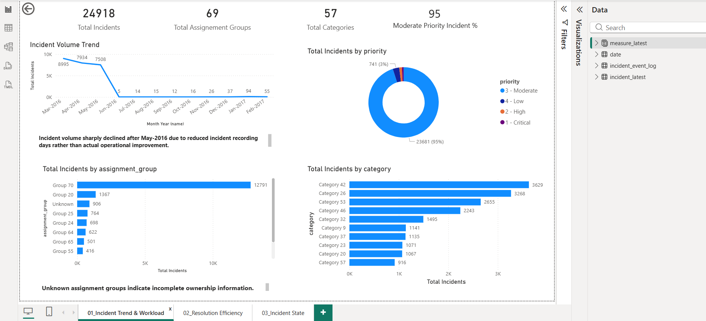
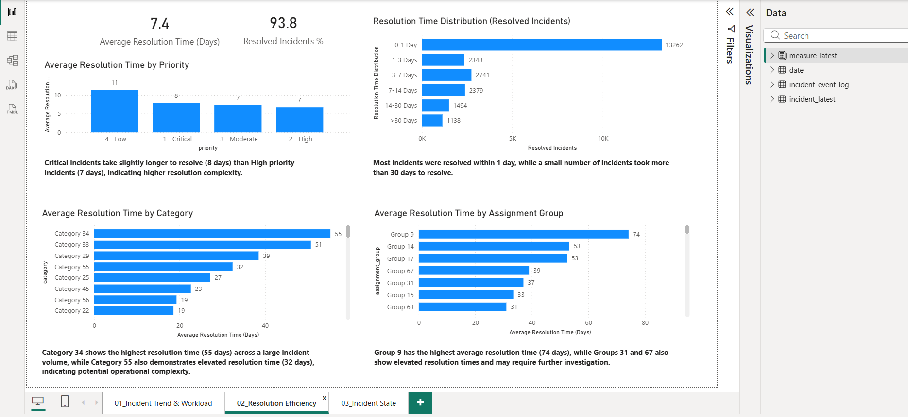
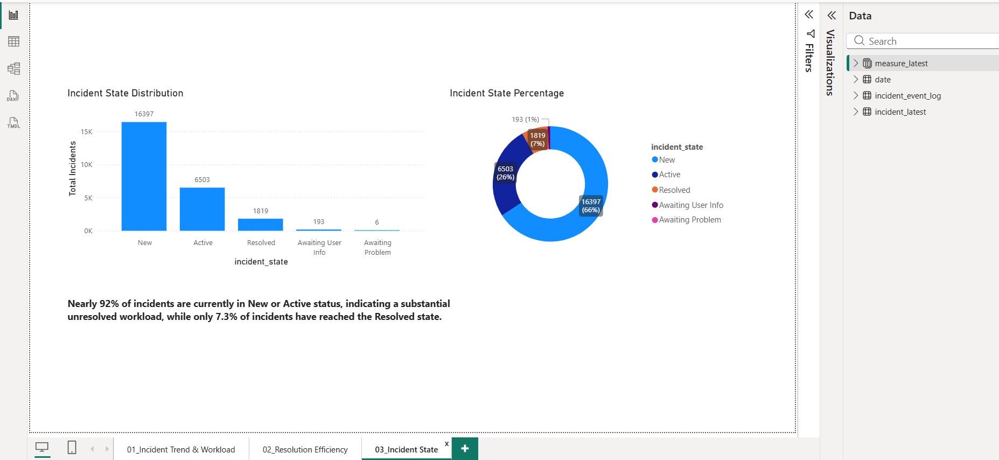

# ITSM Incident Analysis Dashboard

## Project Overview

This project analyzes ITSM incident data to understand workload
patterns, measure resolution efficiency, and evaluate current incident
status using Power BI.

## Objectives

-   Analyze incident volume and workload trends
-   Measure incident resolution efficiency using MTTR
-   Understand incident state distribution
-   Identify operational bottlenecks and workload concentration

## Tools Used

-   Power BI
-   Power Query
-   DAX

## Concepts

-   Data Understanding
-   Data Cleaning
-   Data Validation
-   STAR Schema
-   DAX
-   KPI Design
-   Visualization
-   Business Analysis

## Dashboard Pages

1.  Incident Trend & Workload Analysis

   

2.  Resolution Efficiency Analysis

   

3.  Incident State Analysis

   

## Data Validation Decisions

-   Used latest incident snapshot (24,765 unique incidents)
-   Validated missing values before KPI creation
-   Validated incident counts before creating insights
-   Skipped unsupported business problems instead of forcing conclusions
-   Excluded SLA, Reassignment, Reopen, and Aging analyses because the dataset did not provide meaningful variation for reliable insight generation.

## Key Insights

-   High incidents generated in the month of November
-   Moderate priority incidents contributed 94% of total incident volume
-   Most incidents were resolved in more than 4 hours
-   Assignment Group 70 handled the high incidents
-   Nearly 54% of incidents remained in Active status

## Business Impact

Enabled visibility into incident workload, resolution performance, and
operational status to support better monitoring and prioritization
decisions.

## GitHub Repo Structure

-   datasets/
-   docs/
-   images/
-   powerbi/
-   README.md

## Dataset
Source: Kaggle (ITSM Incident Event Log Dataset)

